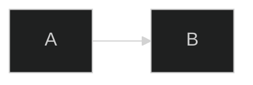
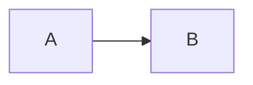
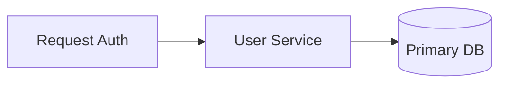
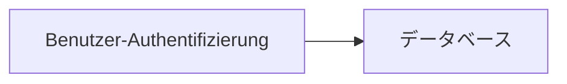
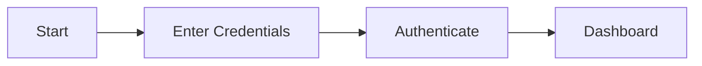

# Syntax Foundations

## Directives

- **`%%{init: {...}}%%`** -- overrides Mermaid config for a single diagram; must appear on the first line



Common init keys:

| Key | Values | Effect |
|-----|--------|--------|
| `theme` | `default`, `dark`, `forest`, `base`, `neutral` | Global color theme |
| `themeVariables` | object | Fine-grained color/font overrides |
| `flowchart.curve` | `basis`, `linear`, `step` | Edge curve style |
| `sequence.showSequenceNumbers` | `true` / `false` | Auto-number messages |
| `logLevel` | `1`–`5` | Verbosity (1 = debug, 5 = fatal) |

## Comments



- `%%` starts a comment to end of line
- No block comment syntax -- use multiple `%%` lines

## Node IDs

Rules:
- **Alphanumeric and underscore only** -- no spaces, hyphens, or special characters in the raw ID
- **Must not start with a number** -- prefix with a letter: `n1`, `id42`
- **Reserved words are forbidden as bare IDs** -- `end`, `style`, `class`, `click`, `subgraph`, `direction`, `graph`, `flowchart`; rename or wrap the label separately



## Label Quoting and Escaping

| Situation | Syntax | Example |
|-----------|--------|---------|
| Plain text label | Bare text | `A[Simple Label]` |
| Label with special chars | Double quotes | `A["Label with (parens)"]` |
| Label with unicode or markdown | Backtick wrapper | `` A[`Label with **bold**`] `` |
| Hash `#` in label | HTML entity `#35;` | `A["Issue #35;42"]` |
| Ampersand `&` in label | HTML entity `#amp;` | `A["A #amp; B"]` |
| Less-than `<` | HTML entity `#lt;` | `A["Value #lt; 10"]` |
| Greater-than `>` | HTML entity `#gt;` | `A["Value #gt; 0"]` |
| Double quote `"` inside label | HTML entity `#quot;` | `A["Say #quot;hello#quot;"]` |
| Semicolon `;` in label | HTML entity `#59;` | `A["step#59; run"]` |
| Parentheses in label | `#40;` / `#41;` or double quotes | `A["fn#40;x#41;"]` or `A["fn(x)"]` |
| Colon in label | Double quotes | `A["Status: OK"]` |

## Arrow and Link Types (Flowchart)

| Syntax | Renders As | Notes |
|--------|-----------|-------|
| `A --> B` | Solid arrow | Default directed edge |
| `A --- B` | Solid line, no arrow | Undirected |
| `A -.-> B` | Dotted arrow | Optional / async path |
| `A ==> B` | Thick solid arrow | Emphasis |
| `A --text--> B` | Solid arrow with inline label | Label on the link |
| `A -->|text| B` | Solid arrow with pipe label | Alternative label syntax |
| `A ~~~B` | Invisible link | Alignment / spacing only |
| `A <--> B` | Bidirectional arrow | Mutual dependency |
| `A --o B` | Circle at end | Aggregation marker |
| `A --x B` | Cross at end | Blocked / terminated path |

Link length -- add extra dashes to increase edge length in auto-layout:

```
A ----> B      %% longer edge
A -..-. B      %% longer dotted
```

## Markdown in Labels

Wrap node label in backticks (inside the shape brackets) to enable Markdown rendering:

```mermaid
flowchart LR
    A["`**Bold text**
    _italic_ and \`code\``"]
    B("`## Heading inside node`")
    A --> B
```

- Requires Mermaid v10.2+ and a renderer that enables `markdownAutoWrap`
- Newlines in backtick labels render as line breaks

## Unicode Support

- Unicode characters in labels are supported natively when using double-quote or backtick syntax
- Avoid Unicode in node IDs -- use ASCII IDs, put Unicode in the label



## Accessibility Directives



| Directive | Purpose |
|-----------|---------|
| `accTitle: text` | Sets `<title>` on the SVG -- read by screen readers |
| `accDescr: text` | Single-line `<desc>` on the SVG |
| `accDescr { ... }` | Multi-line description block |

## Common Parse Errors

| Error / Symptom | Cause | Fix |
|----------------|-------|-----|
| `Parse error` on label with `()` | Parentheses conflict with rounded-node syntax | Wrap label in double quotes or use `#40;` / `#41;` |
| `Parse error` on label with `:` | Colon is a delimiter in some contexts | Wrap label in double quotes |
| `Parse error` on node starting with digit | Node IDs cannot start with a number | Prefix with a letter: `n1`, `id42` |
| `Parse error` on reserved word ID | `end`, `style`, `class`, `click`, `subgraph` used as ID | Rename the node ID |
| Rendering stops mid-diagram | Missing space after arrow (`A-->B` with no space after ID) | Add space: `A --> B` |
| Label with `#` renders as `#` literally | Bare `#` not escaped | Use `#35;` HTML entity |
| Label with `"` breaks parse | Unescaped double quote inside double-quoted label | Use `#quot;` entity inside the label |
| Empty subgraph causes error | Subgraph with no nodes inside | Add at least one node inside the subgraph |
| `&` renders as blank or errors | Bare ampersand in label | Use `#amp;` entity |
| Semicolon breaks label | `;` treated as statement terminator in some renderers | Use `#59;` entity |
