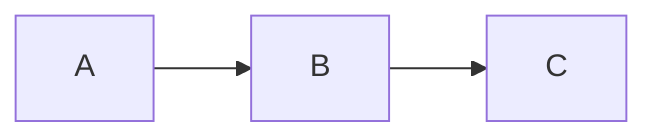
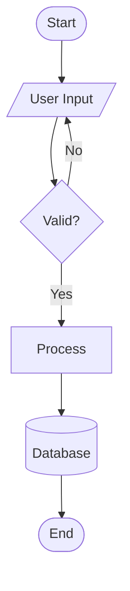
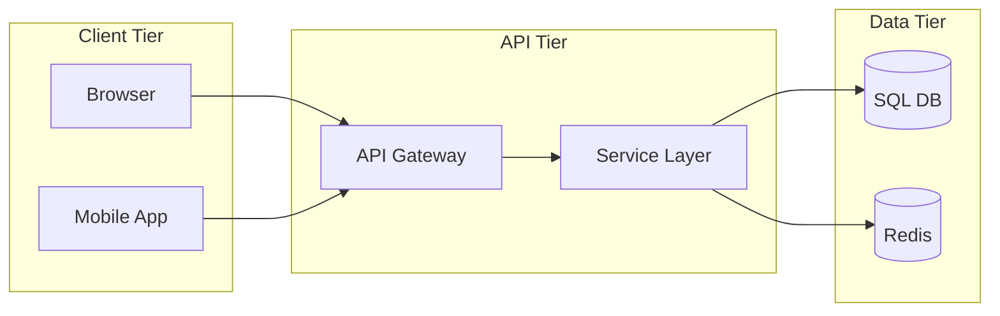
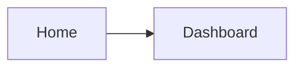
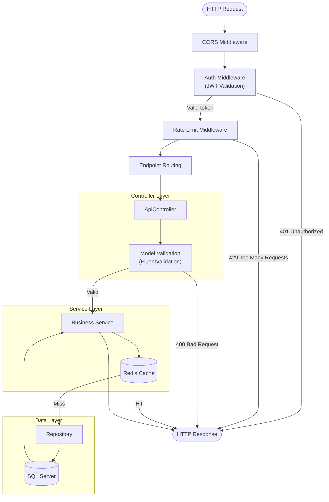

# Flowchart

## Direction Keywords

| Keyword | Direction |
|---------|-----------|
| `TB` | Top to bottom (default) |
| `TD` | Top-down (alias for TB) |
| `BT` | Bottom to top |
| `LR` | Left to right |
| `RL` | Right to left |



## Node Shapes

| Syntax | Shape | Use for |
|--------|-------|---------|
| `A[text]` | Rectangle | Default process step |
| `A(text)` | Rounded rectangle | Start / end (rounded corners) |
| `A([text])` | Stadium / pill | Terminal node |
| `A[[text]]` | Subroutine | Predefined process / function call |
| `A[(text)]` | Cylinder | Database / data store |
| `A((text))` | Circle | Junction / connector |
| `A{text}` | Diamond | Decision / condition |
| `A{{text}}` | Hexagon | Preparation / config step |
| `A[/text/]` | Parallelogram | Input / output |
| `A[\text\]` | Parallelogram (alt) | Alternate I/O direction |
| `A[/text\]` | Trapezoid | Manual operation |
| `A[\text/]` | Trapezoid (alt) | Manual input |
| `A>text]` | Asymmetric / flag | Tagged / annotated step |



## Link Types

See [01-syntax-foundations.md](./01-syntax-foundations.md) for the full arrow type table. Flowchart-specific usage patterns:

```mermaid
flowchart LR
    A -->|happy path| B
    A -.->|async call| C
    B ==>|critical path| D
    C --> D
    D ~~~E         %% invisible link for vertical alignment
    E --o F        %% aggregation
    F --x G        %% blocked path
```

- **Label placement**: `-->|label|` and `--label-->` are equivalent; prefer `-->|label|` for readability
- **Multi-target shorthand**: `A --> B & C & D` links A to B, C, and D simultaneously

## Subgraphs



Key rules:
- **`subgraph id["Label"]`** -- ID is the linkable identifier; label is the display name
- **`direction TB|LR|...`** inside a subgraph overrides layout direction for that group only
- **Linking between subgraphs** -- use the subgraph ID as a node target: `A --> subgraphId`
- **Nesting** -- subgraphs can contain other subgraphs; keep to 2 levels to avoid layout issues
- **No reserved word IDs** -- avoid `end` as a subgraph ID

## Click Events



| Syntax | Behavior |
|--------|----------|
| `click nodeId href "url"` | Navigate to URL on click |
| `click nodeId href "url" "tooltip"` | URL click with hover tooltip |
| `click nodeId callback "fnName"` | Call JavaScript function |
| `click nodeId call fnName()` | Alternative callback syntax |

- `_blank` target: `click A href "url" _blank`
- Click events require the renderer to have `securityLevel` set to `loose`

## Layout Tips

- **Invisible links for alignment** -- `A ~~~ B` forces spacing without a visible edge; useful for vertically aligning parallel branches
- **Keep subgraphs small** -- large subgraphs confuse the auto-layout engine; split into sibling subgraphs and link them
- **Consistent direction** -- mixing `LR` and `TB` within nested subgraphs produces unpredictable results; override direction only when necessary
- **Long labels push edges** -- use short node labels and put detail in tooltips or notes
- **Multi-edge shorthand** -- `A --> B & C` is cleaner than two separate edge declarations
- **Avoid cycles in subgraph boundaries** -- edges that cross subgraph boundaries in both directions confuse layout; use a single crossing direction

## Full Example: .NET Request Pipeline


