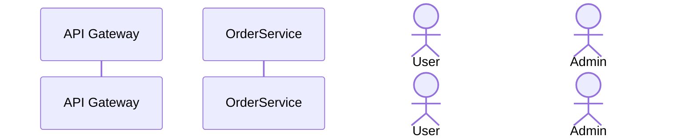
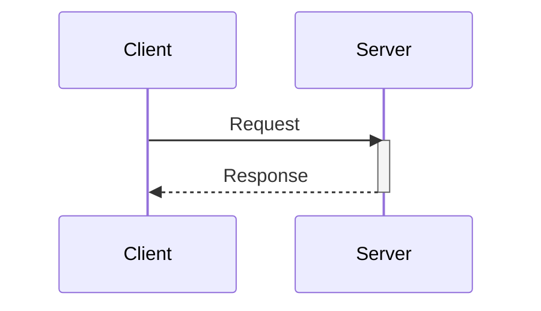
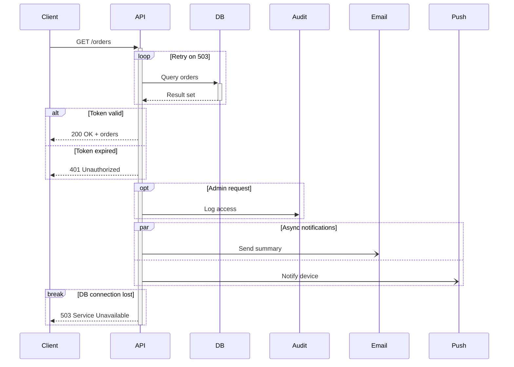
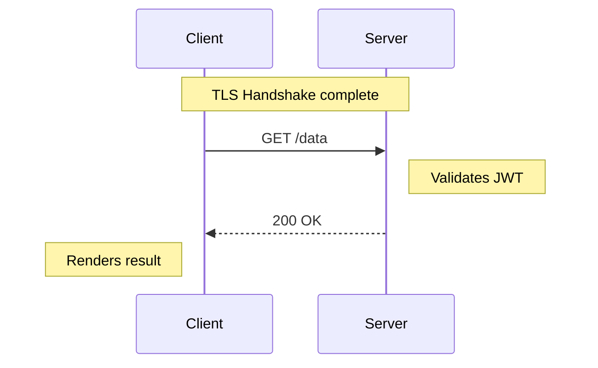
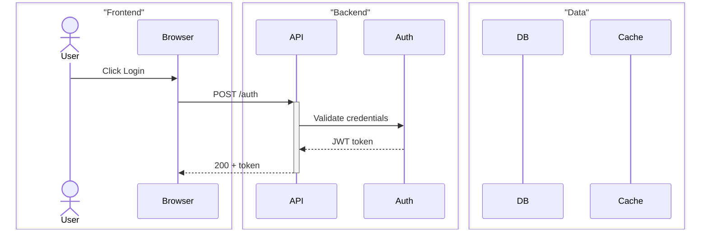
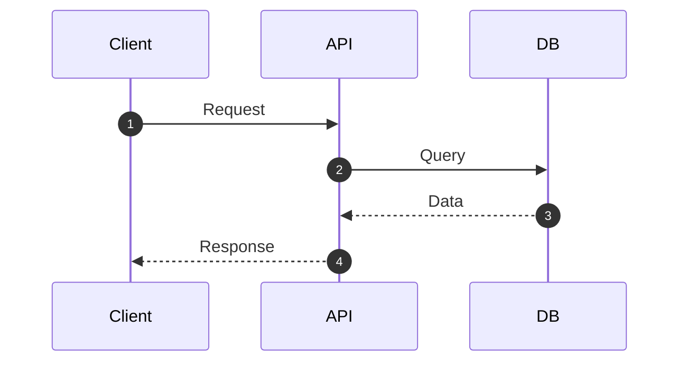
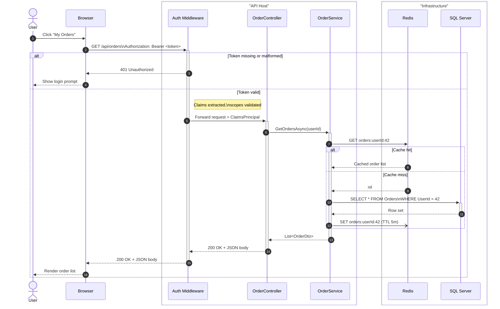

# Sequence Diagram

## Participant Declaration

| Syntax | Renders As |
|--------|-----------|
| `participant A` | Box labeled "A" |
| `participant A as Alias` | Box with display name "Alias", ID remains "A" |
| `actor U` | Stick figure labeled "U" |
| `actor U as User` | Stick figure with display name "User" |

- Participants are displayed left-to-right in declaration order
- Declare all participants at the top to control ordering; undeclared participants appear on first use

## Message Types

| Syntax | Arrow Style | Notes |
|--------|------------|-------|
| `A->B: msg` | Solid line, no arrowhead | Rarely used; open line |
| `A-->B: msg` | Dotted line, no arrowhead | Response / optional |
| `A->>B: msg` | Solid line with filled arrowhead | Standard synchronous call |
| `A-->>B: msg` | Dotted line with filled arrowhead | Standard response / return |
| `A-xB: msg` | Solid line with X at end | Lost message / error |
| `A--xB: msg` | Dotted line with X at end | Lost async message |
| `A-)B: msg` | Solid line with open arrowhead | Fire-and-forget async |
| `A--)B: msg` | Dotted line with open arrowhead | Async response |

Conventions:
- **Request** -- use `->>` (solid, arrowhead)
- **Response / return value** -- use `-->>` (dotted, arrowhead)
- **Async / event** -- use `-)` or `--)` (open arrowhead)
- **Error / dead message** -- use `-x` or `--x`

## Activations

Activation bars show when a participant is actively processing.

**Explicit syntax:**

**Shorthand (`+` / `-` on the arrow):**

- `+` on the target activates it
- `-` on the sender deactivates it (must match a prior `+`)
- Activations can nest -- each `+` stacks a new bar; each `-` pops one

## Control Flow Blocks

| Block | Syntax | Purpose |
|-------|--------|---------|
| Loop | `loop [label] ... end` | Repetition |
| Alt / Else | `alt [cond] ... else [cond] ... end` | Conditional branches |
| Optional | `opt [cond] ... end` | Zero-or-one execution |
| Parallel | `par [label] ... and [label] ... end` | Concurrent execution |
| Critical | `critical [label] ... option [label] ... end` | Required with fallback |
| Break | `break [label] ... end` | Early exit / exception path |

## Notes

| Syntax | Placement |
|--------|-----------|
| `Note right of A: text` | Right side of participant A |
| `Note left of A: text` | Left side of participant A |
| `Note over A: text` | Centered above participant A |
| `Note over A,B: text` | Spanning from A to B |

## Participant Boxes

Groups related participants under a labeled background box:

- Color hint is optional: `box "Label" #hexOrColorName`
- All participants inside the box must be declared between `box` and `end`

## Autonumber

- `autonumber` prefixes each message arrow with an incrementing integer
- Place `autonumber` before any messages

## Full Example: .NET API Request with Auth

