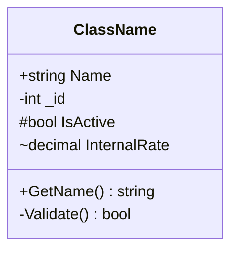
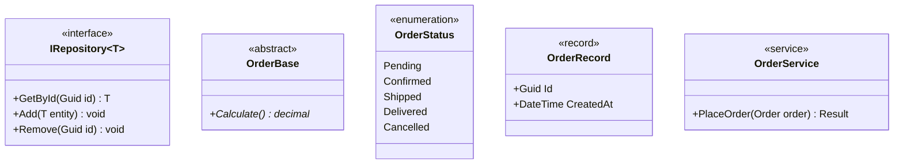
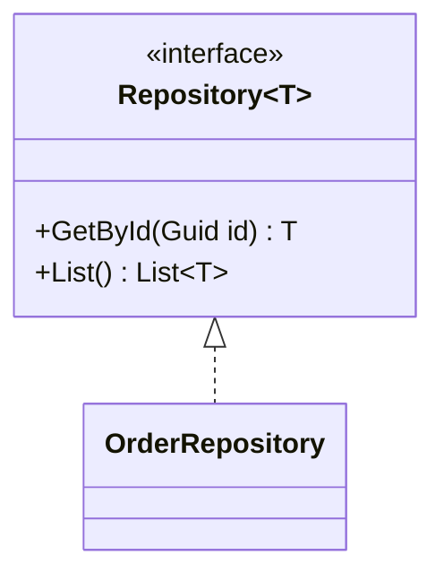
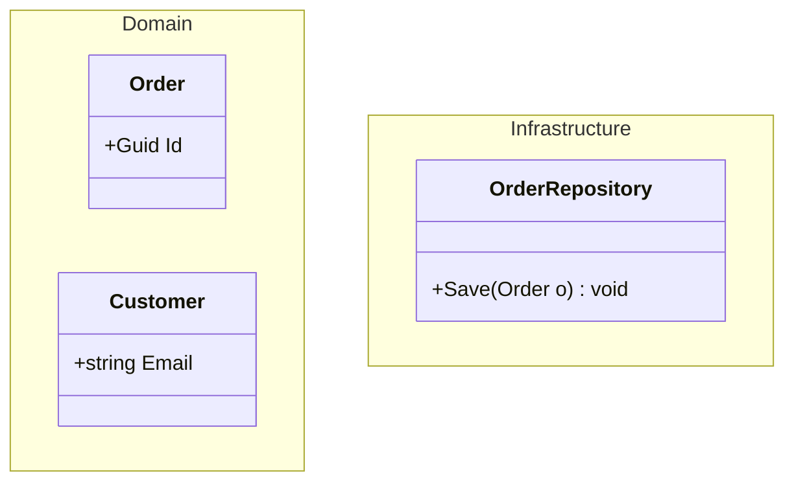
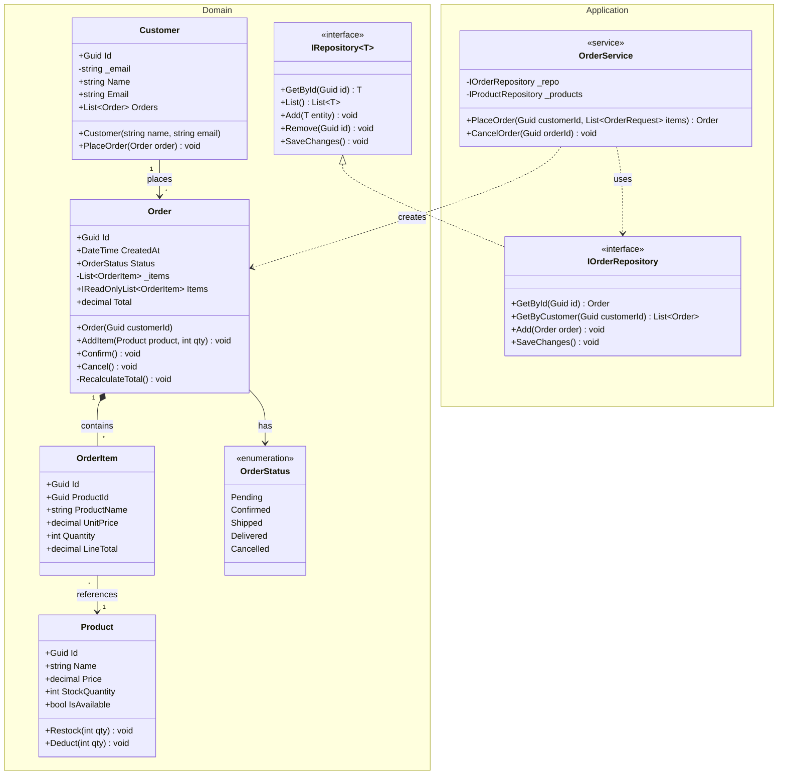

# Class Diagram

## Declaration



## Visibility Markers

| Marker | Visibility         | .NET Equivalent         |
|--------|--------------------|-------------------------|
| `+`    | Public             | `public`                |
| `-`    | Private            | `private`               |
| `#`    | Protected          | `protected`             |
| `~`    | Package / Internal | `internal`              |

## Members

### Attributes (fields / properties)

```
+string Name
-int _count
#Guid Id
~decimal Rate
```

- Format: `[visibility][type] [name]`
- No semicolons or initializers

### Methods

```
+GetById(int id) Order
-Validate() bool
#OnChanged() void
+Create(string name, decimal price)$
```

- Format: `[visibility][name]([params]) [returnType]`
- **`$` suffix** -- static member
- **`*` suffix** -- abstract member
- Omit return type for `void` or when unimportant

## Relationships

| Syntax       | Meaning                   | .NET Pattern                        |
|--------------|---------------------------|-------------------------------------|
| `<\|--`      | Inheritance (extends)     | `: BaseClass`                       |
| `*--`        | Composition               | Owned object, same lifetime         |
| `o--`        | Aggregation               | Reference, independent lifetime     |
| `-->`        | Association               | Field reference                     |
| `..>`        | Dependency                | Method parameter / local variable   |
| `..\|>`      | Realization (implements)  | `: IInterface`                      |
| `--`         | Link (solid, undirected)  | General relationship                |
| `..`         | Link (dashed, undirected) | Weaker / optional relationship      |

Direction is left-to-right in the arrow: `Child <|-- Parent` means Parent inherits Child... avoid confusion by writing `Parent --|> Child` (child on right points up to parent).

## Cardinality

Place labels in quotes on both ends of the relationship line:

```
Order "1" --> "*" OrderItem : contains
Customer "1" o-- "0..1" Address : has
Product "*" --> "*" Category : belongs to
```

| Label   | Meaning           |
|---------|-------------------|
| `1`     | Exactly one       |
| `0..1`  | Zero or one       |
| `*`     | Zero or many      |
| `1..*`  | One or many       |
| `N`     | Exact number      |

## Annotations

Placed inside the class block or on a separate line using `<<annotation>>`:



| Annotation        | Use Case                        |
|-------------------|---------------------------------|
| `<<interface>>`   | C# interface                    |
| `<<abstract>>`    | Abstract base class             |
| `<<enumeration>>` | C# enum                         |
| `<<record>>`      | C# record type                  |
| `<<service>>`     | Application / domain service    |

## Generic Types

Use tilde (`~`) for type parameters -- angle brackets are not supported in Mermaid:



- `List~T~` renders as `List<T>`
- `Dictionary~K,V~` renders as `Dictionary<K, V>`

## Namespace Blocks

Group classes visually with `namespace`:



- Namespace blocks are visual groupings only -- no effect on relationship syntax
- Relationships across namespaces work normally

## Direction

```mermaid
classDiagram
    direction RL
```

| Value | Meaning         |
|-------|-----------------|
| `TB`  | Top to bottom (default) |
| `BT`  | Bottom to top   |
| `LR`  | Left to right   |
| `RL`  | Right to left   |

Place `direction` at the top of the diagram before class definitions.

## Full Example: .NET Domain Model

Order aggregate with Customer, Product, and repository interface.



## Common Mistakes

- **Using `<` or `>` for generics** -- use `~T~` instead; angle brackets break the parser
- **Reversing inheritance arrow direction** -- `A <|-- B` means B inherits A; read the filled arrowhead as pointing to the parent
- **Mixing relationship styles** -- pick composition vs aggregation intentionally; `*--` implies owned lifetime, `o--` implies independent
- **Putting too much detail in diagrams** -- show architectural relationships, not every private field; omit implementation details not relevant to the audience
- **Omitting cardinality** -- always annotate `"1"` and `"*"` on associations for clarity
