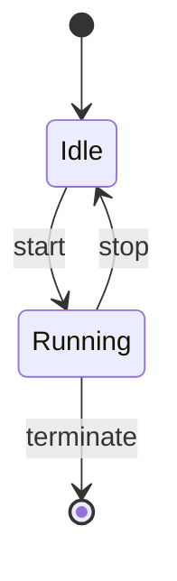
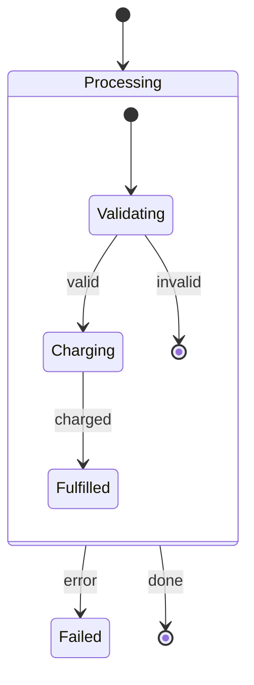
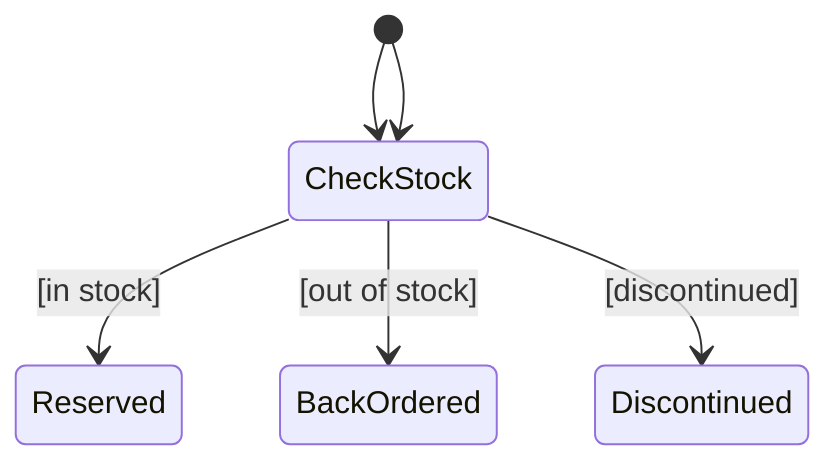
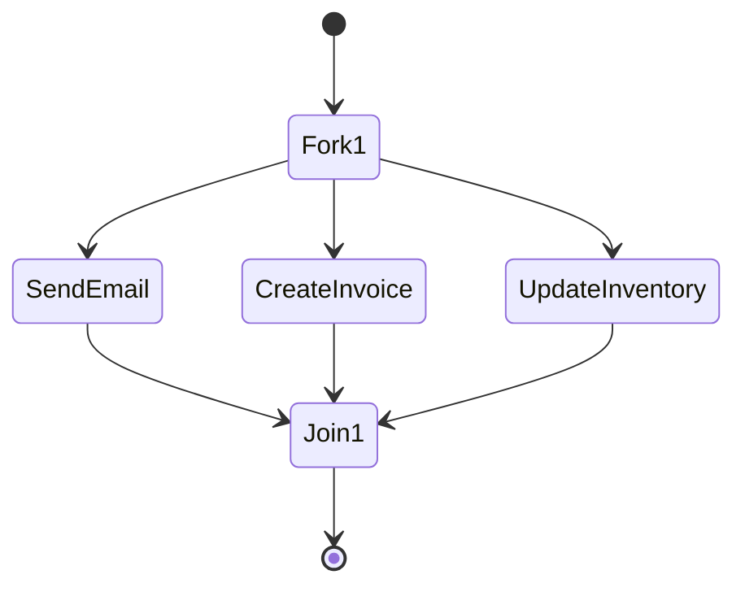
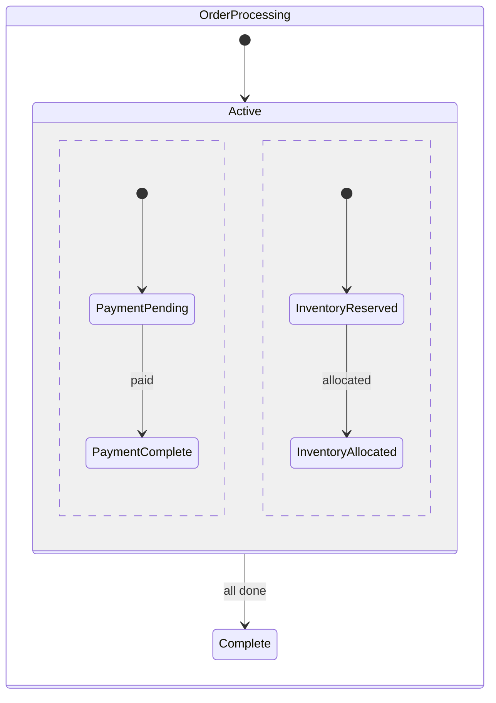
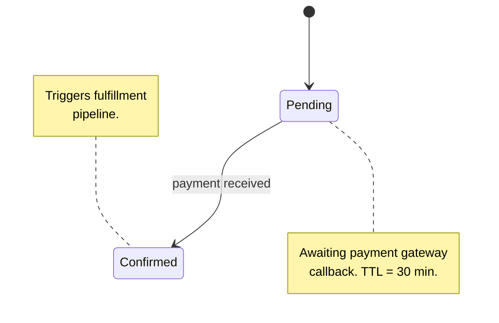
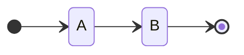
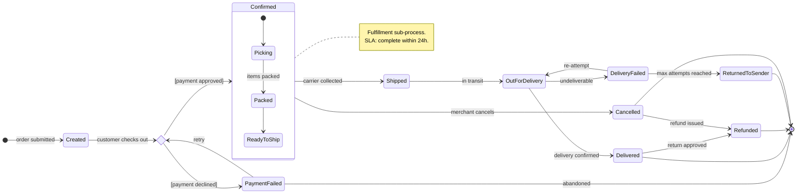

# State Diagram

## Declaration

Always use `stateDiagram-v2`. The original `stateDiagram` is deprecated and lacks composite state, concurrency, and choice support.



## States

### Simple state

```
s1
```

### State with description

```
s1 : Waiting for Payment
```

- The description replaces the state ID as the display label

### Long name alias

```
state "Waiting for Payment Authorization" as WaitingAuth
```

- Use `state "..." as id` when the display name would otherwise be invalid as an identifier

## Transitions

| Syntax                    | Meaning                          |
|---------------------------|----------------------------------|
| `s1 --> s2`               | Transition (no label)            |
| `s1 --> s2 : event`       | Transition with event/label      |
| `[*] --> s1`              | Entry point (start)              |
| `s1 --> [*]`              | Exit point (end / terminal)      |

- Multiple transitions from the same state are valid -- each is a separate line
- Multiple `[*] --> sN` entries create multiple start states (use sparingly)

## Composite States

Nest states inside a parent state block to model sub-state machines:



- Entry/exit points inside the composite (`[*]`) are local to that block
- Transitions from the parent label (`Processing --> Failed`) fire from any sub-state

## Choice Pseudostate

Model conditional branching with `<<choice>>`:



- **`state id <<choice>>`** -- declares a diamond decision node
- Transition labels on branches act as guards

## Fork and Join

Model parallel execution with `<<fork>>` and `<<join>>`:



- **`<<fork>>`** -- splits into parallel flows
- **`<<join>>`** -- waits for all incoming flows before continuing

## Concurrency

Use `--` inside a composite state to define parallel regions:



- `--` separator creates horizontal concurrent regions inside the composite
- Each region has its own `[*]` start and runs independently

## Notes



| Syntax               | Placement            |
|----------------------|----------------------|
| `note right of sN`   | Right side of state  |
| `note left of sN`    | Left side of state   |

- Close with `end note`
- Multi-line content is supported between declaration and `end note`

## Direction



| Value | Meaning                   |
|-------|---------------------------|
| `TB`  | Top to bottom (default)   |
| `LR`  | Left to right             |

- `direction` can be placed at the top level or inside a composite state block to control only that region
- `BT` and `RL` are supported but rarely useful for state diagrams

## v2 Syntax Notes

| Feature               | v1 (`stateDiagram`) | v2 (`stateDiagram-v2`) |
|-----------------------|---------------------|------------------------|
| Composite states      | Limited             | Full support           |
| Concurrency (`--`)    | No                  | Yes                    |
| Choice (`<<choice>>`) | No                  | Yes                    |
| Fork/Join             | No                  | Yes                    |
| Notes                 | No                  | Yes                    |
| Direction             | No                  | Yes                    |

**Always use `stateDiagram-v2`.**

## Full Example: Order Lifecycle State Machine



## Common Mistakes

- **Using `stateDiagram` instead of `stateDiagram-v2`** -- the v1 syntax silently omits composite states, concurrency, and choice nodes
- **Missing `[*]` inside composite states** -- composite states need their own `[*] --> firstChild` entry; without it the sub-state machine has no entry point
- **Forgetting `end note`** -- notes must be closed explicitly; an unclosed note breaks the entire diagram
- **Overloading transition labels** -- a label is an event or guard, not a multi-sentence description; keep labels short and use notes for elaboration
- **Using `<<fork>>` without a matching `<<join>>`** -- parallel regions that never converge produce diagrams that imply the process never completes
