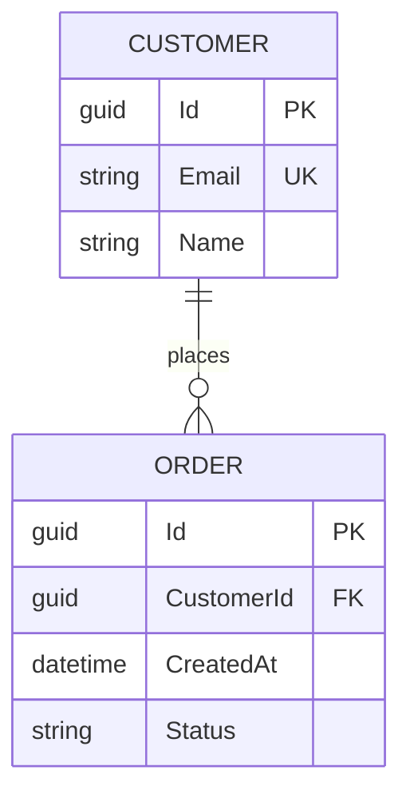
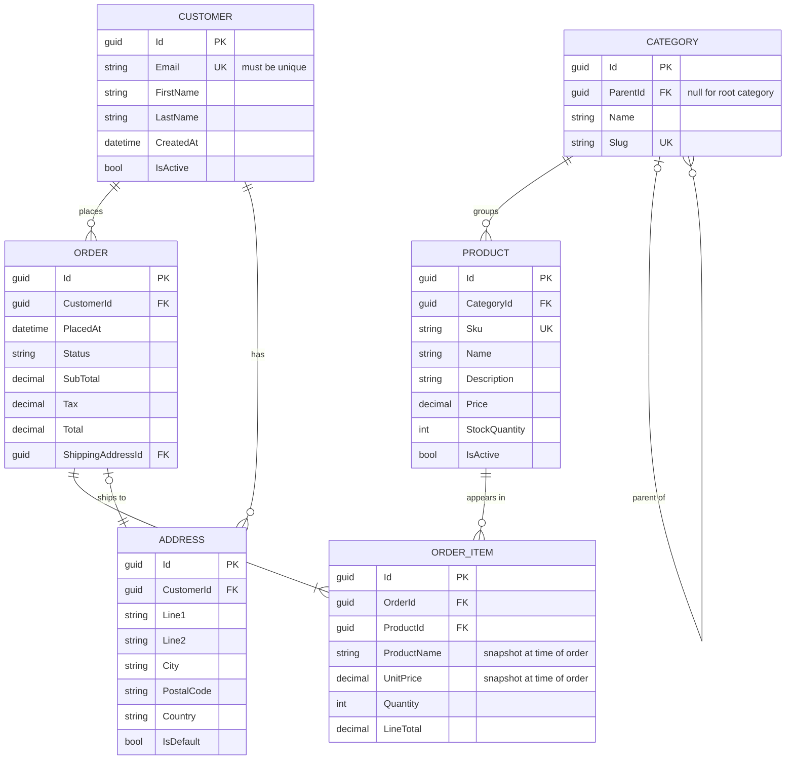

# ER Diagram

## Declaration



## Entity Definition

```
ENTITY_NAME {
    type   attributeName  Marker  "optional comment"
}
```

- **Entity names** -- uppercase by convention; underscores for multi-word (`ORDER_ITEM`)
- **Marker** -- optional; `PK`, `FK`, `UK` (see table below)
- **Comment** -- optional string in quotes after marker

### Attribute Markers

| Marker | Meaning         | .NET / EF Core Equivalent     |
|--------|-----------------|-------------------------------|
| `PK`   | Primary key     | `[Key]` / `HasKey()`          |
| `FK`   | Foreign key     | `[ForeignKey]` / `HasForeignKey()` |
| `UK`   | Unique key      | `HasAlternateKey()` / `IsUnique()` |

- Multiple markers are not supported on a single attribute -- choose the most specific
- Composite keys: mark each participating column with `PK`

### Attribute Types

| Type       | Maps To                         |
|------------|---------------------------------|
| `guid`     | `Guid` / `uniqueidentifier`     |
| `int`      | `int` / `INT`                   |
| `bigint`   | `long` / `BIGINT`               |
| `string`   | `string` / `NVARCHAR`           |
| `bool`     | `bool` / `BIT`                  |
| `datetime` | `DateTime` / `DATETIME2`        |
| `decimal`  | `decimal` / `DECIMAL(p,s)`      |
| `float`    | `double` / `FLOAT`              |
| `enum`     | C# enum (stored as int/string)  |

- Types are display labels only -- Mermaid does not validate them
- Use types that match your team's conventions (SQL types, C# types, or domain types)

## Cardinality / Relationship Syntax

```
ENTITY_A  [left-cardinality]--[right-cardinality]  ENTITY_B : "label"
```

### Relationship Table

| Syntax    | Meaning                              |
|-----------|--------------------------------------|
| `\|\|--\|\|` | Exactly one to exactly one        |
| `\|\|--o{` | One to zero or many               |
| `\|\|--\|{` | One to one or many               |
| `o{--o{`  | Zero or many to zero or many         |
| `o\|--o{` | Zero or one to zero or many          |
| `o\|--\|\|` | Zero or one to exactly one        |

### Cardinality Symbol Key

| Symbol | Meaning       |
|--------|---------------|
| `\|`   | Exactly one   |
| `o`    | Zero          |
| `{`    | Many          |

Combine: `\|{` = one or many, `o{` = zero or many, `o\|` = zero or one.

### Examples

```
CUSTOMER ||--o{ ORDER : "places"         -- one customer, zero or many orders
ORDER    ||--|{ ORDER_ITEM : "contains"  -- one order, one or many items
PRODUCT  o|--o{ ORDER_ITEM : "appears"  -- optional product, zero or many items
```

## Identifying vs Non-Identifying Relationships

| Style    | Syntax example          | Meaning                                           |
|----------|-------------------------|---------------------------------------------------|
| Identifying     | `\|\|--\|{`     | Child cannot exist without parent (solid line)    |
| Non-identifying | `\|\|..o{`      | Child can exist independently (dashed line)       |

- **Solid line** (`--`) -- identifying: child PK includes parent FK (e.g., `OrderItem`)
- **Dashed line** (`..`) -- non-identifying: child has its own independent PK (e.g., `Customer` to `Address` when address is optional)

```
ORDER    ||--|{ ORDER_ITEM : "contains"   -- identifying (dashed not valid here)
CUSTOMER ||..o{ ADDRESS   : "has"         -- non-identifying (address is optional)
```

## Relationship Labels

- Always wrap labels in quotes: `"places"`, `"contains"`, `"belongs to"`
- Use active verbs from the perspective of the left entity
- Keep labels short -- one or two words

## EF Core Mapping Patterns

| ER Relationship        | EF Core Fluent API                                                                                     |
|------------------------|--------------------------------------------------------------------------------------------------------|
| One-to-many            | `HasMany(c => c.Orders).WithOne(o => o.Customer).HasForeignKey(o => o.CustomerId)`                    |
| One-to-one             | `HasOne(c => c.Profile).WithOne(p => p.Customer).HasForeignKey<Profile>(p => p.CustomerId)`           |
| Many-to-many (implicit)| `HasMany(p => p.Categories).WithMany(c => c.Products)` -- EF Core creates join table automatically   |
| Many-to-many (explicit)| `HasMany(p => p.OrderItems).WithOne(i => i.Product).HasForeignKey(i => i.ProductId)`                  |
| Required / identifying | `.IsRequired()` on the FK property; cascade delete default                                            |
| Optional / non-identifying | FK property is nullable (`Guid?`); `.IsRequired(false)`                                        |

## Full Example: E-Commerce Domain



### EF Core Configuration for Above

```csharp
// Customer -> Orders (one-to-many)
modelBuilder.Entity<Customer>()
    .HasMany(c => c.Orders)
    .WithOne(o => o.Customer)
    .HasForeignKey(o => o.CustomerId)
    .OnDelete(DeleteBehavior.Restrict);

// Order -> OrderItems (one-to-many, identifying)
modelBuilder.Entity<Order>()
    .HasMany(o => o.Items)
    .WithOne(i => i.Order)
    .HasForeignKey(i => i.OrderId)
    .OnDelete(DeleteBehavior.Cascade);

// Product -> OrderItems (one-to-many)
modelBuilder.Entity<OrderItem>()
    .HasOne(i => i.Product)
    .WithMany(p => p.OrderItems)
    .HasForeignKey(i => i.ProductId)
    .OnDelete(DeleteBehavior.Restrict);

// Category self-referencing (parent/child)
modelBuilder.Entity<Category>()
    .HasOne(c => c.Parent)
    .WithMany(c => c.Children)
    .HasForeignKey(c => c.ParentId)
    .IsRequired(false)
    .OnDelete(DeleteBehavior.Restrict);

// Unique constraints
modelBuilder.Entity<Customer>()
    .HasIndex(c => c.Email).IsUnique();

modelBuilder.Entity<Product>()
    .HasIndex(p => p.Sku).IsUnique();
```

## Common Mistakes

- **Omitting relationship labels** -- labels are required in `erDiagram`; the parser errors without them
- **Using angle brackets or special characters in entity names** -- stick to uppercase letters, digits, and underscores
- **Marking a column as both PK and FK** -- choose `PK` for the primary key column; document the FK relationship via the relationship line, not the attribute marker
- **Confusing `\|{` and `o{`** -- `\|{` means one or many (at least one required); `o{` means zero or many (optional); use `\|{` for required children like `ORDER_ITEM`
- **Snapshotting mutable data** -- in `ORDER_ITEM`, always copy `ProductName` and `UnitPrice` at order time; never FK-join to live product data for historical orders
- **Using dashed lines for all relationships** -- dashed lines signal optional / non-identifying; overusing them loses the structural meaning of the diagram
