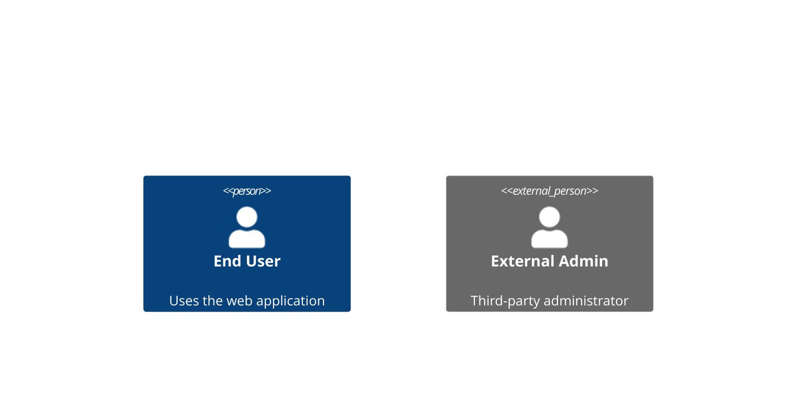
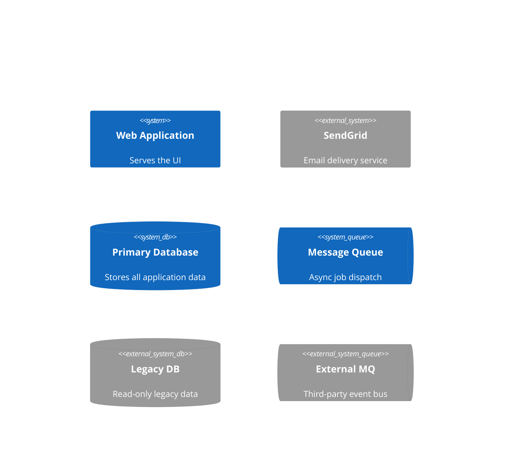
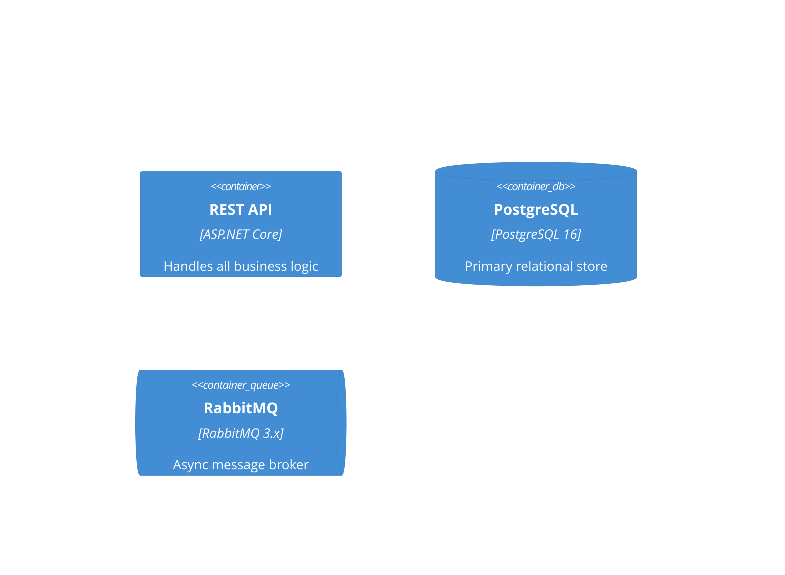
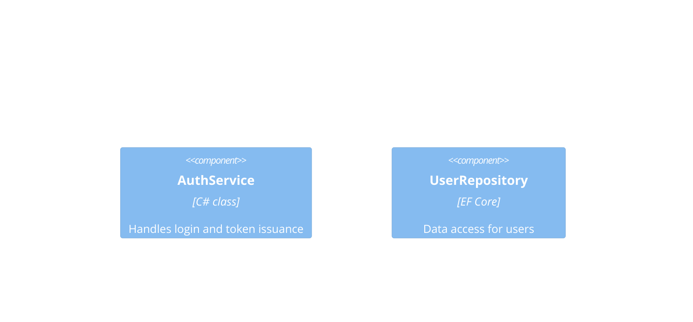
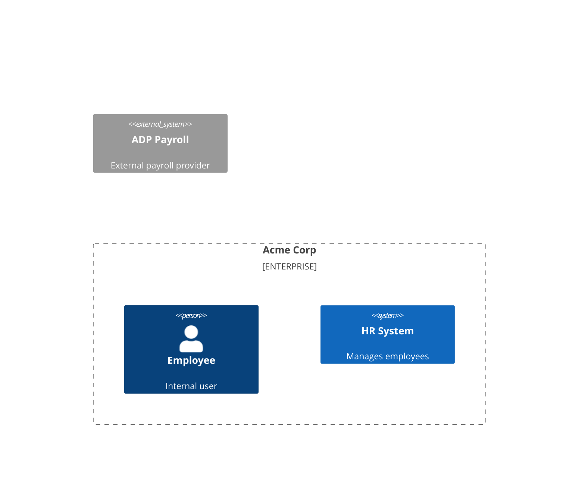
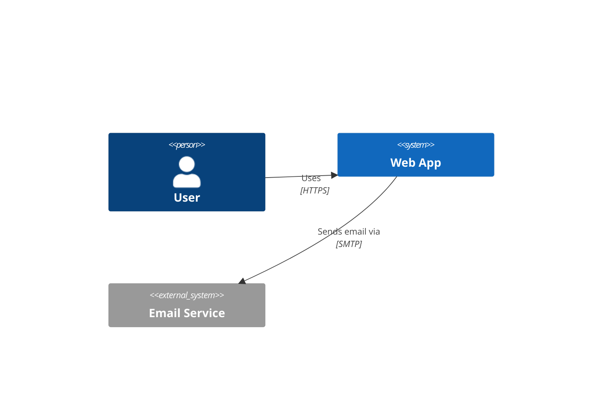
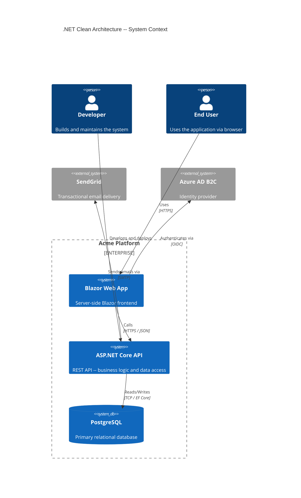
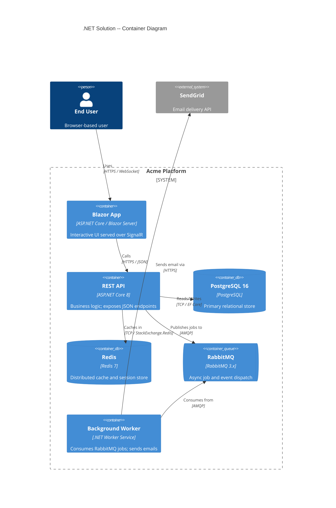

# C4 Diagram

## Overview

- Syntax prefix: `C4Context`, `C4Container`, `C4Component`, `C4Deployment`
- Based on the [C4 model](https://c4model.com/) by Simon Brown
- **Dynamic diagrams are not supported in Mermaid** -- use sequence or flowchart diagrams instead
- Each level is a separate diagram type; do not mix levels in one diagram

| Level | Syntax Prefix | Shows |
|-------|--------------|-------|
| Context | `C4Context` | People, systems, external dependencies |
| Container | `C4Container` | Apps, databases, services within a system |
| Component | `C4Component` | Internal components of a single container |
| Deployment | `C4Deployment` | Infrastructure nodes and deployed containers |

## Person Elements



| Element | Signature | Use |
|---------|-----------|-----|
| `Person` | `Person(alias, "Name", "Desc")` | Internal user |
| `Person_Ext` | `Person_Ext(alias, "Name", "Desc")` | External user -- renders with different styling |

## System Elements



| Element | Signature | Shape |
|---------|-----------|-------|
| `System` | `System(alias, "Name", "Desc")` | Rectangle |
| `System_Ext` | `System_Ext(alias, "Name", "Desc")` | Rectangle, greyed |
| `SystemDb` | `SystemDb(alias, "Name", "Desc")` | Cylinder |
| `SystemQueue` | `SystemQueue(alias, "Name", "Desc")` | Queue shape |
| `SystemDb_Ext` | `SystemDb_Ext(alias, "Name", "Desc")` | Cylinder, greyed |
| `SystemQueue_Ext` | `SystemQueue_Ext(alias, "Name", "Desc")` | Queue shape, greyed |

## Container Elements



| Element | Signature | Shape |
|---------|-----------|-------|
| `Container` | `Container(alias, "Name", "Technology", "Desc")` | Rectangle |
| `ContainerDb` | `ContainerDb(alias, "Name", "Technology", "Desc")` | Cylinder |
| `ContainerQueue` | `ContainerQueue(alias, "Name", "Technology", "Desc")` | Queue shape |

## Component Elements



- `Component(alias, "Name", "Technology", "Desc")` -- no `Component_Ext` variant; use `System_Ext` at container level for external references

## Boundaries

Boundaries visually group related elements.



| Boundary | Signature | Use |
|----------|-----------|-----|
| `Boundary` | `Boundary(alias, "Name", "Type") { ... }` | Generic boundary with type label |
| `System_Boundary` | `System_Boundary(alias, "Name") { ... }` | Wraps containers belonging to one system |
| `Container_Boundary` | `Container_Boundary(alias, "Name") { ... }` | Wraps components within one container |
| `Enterprise_Boundary` | `Enterprise_Boundary(alias, "Name") { ... }` | Corporate / organizational boundary |

- **Boundaries must contain at least one element** -- empty boundaries cause parse errors

## Deployment Elements

```mermaid
C4Deployment
    Deployment_Node(azure, "Azure", "Cloud") {
        Deployment_Node(rg, "Resource Group", "Azure RG") {
            Node(appSvc, "App Service", "Linux, .NET 8")
            Node(sqlDb, "Azure SQL", "SQL Server 2022")
        }
    }
```

| Element | Signature | Use |
|---------|-----------|-----|
| `Deployment_Node` | `Deployment_Node(alias, "Name", "Technology", "Desc")` | Infrastructure node (region, cluster, server) |
| `Node` | `Node(alias, "Name", "Technology")` | Shorthand for `Deployment_Node` -- same rendering |
| `Node_L` | `Node_L(alias, "Name", "Technology")` | Node pinned to left in layout |
| `Node_R` | `Node_R(alias, "Name", "Technology")` | Node pinned to right in layout |

- Containers deployed inside nodes use `Container`, `ContainerDb`, `ContainerQueue` inside the `Deployment_Node` block

## Relationships



| Relationship | Direction | Notes |
|-------------|-----------|-------|
| `Rel(from, to, "label")` | Auto | Default; layout engine chooses direction |
| `Rel(from, to, "label", "technology")` | Auto | Optional fourth arg for protocol/technology |
| `Rel_D(from, to, "label")` | Down | Forces downward arrow |
| `Rel_U(from, to, "label")` | Up | Forces upward arrow |
| `Rel_L(from, to, "label")` | Left | Forces leftward arrow |
| `Rel_R(from, to, "label")` | Right | Forces rightward arrow |
| `BiRel(from, to, "label")` | Bidirectional | Double-headed arrow |

- Directional `Rel_D/U/L/R` are hints only -- the renderer may override for layout reasons

## Layout Configuration

```mermaid
C4Context
    UpdateLayoutConfig($c4ShapeInRow="3", $c4BoundaryInRow="1")
    %% shapes per row and boundaries per row
```

- **`$c4ShapeInRow`** -- maximum elements per row inside a boundary (default `4`)
- **`$c4BoundaryInRow`** -- maximum boundaries per row at the same level (default `2`)
- Place `UpdateLayoutConfig` before element definitions for predictable results

## Full Example: C4 Context -- .NET Clean Architecture



## Full Example: C4 Container -- .NET Solution



## Common Mistakes

- **Mixing diagram levels in one diagram** -- `C4Context` and `C4Container` elements cannot be used together in one diagram block
- **Using `C4Dynamic`** -- not supported in Mermaid; use `sequenceDiagram` instead
- **Empty boundaries** -- boundaries with no child elements cause parse errors
- **Omitting quotes around labels** -- all `Name` and `Desc` arguments require double quotes
- **Using `Rel` directional hints as guarantees** -- `Rel_L` / `Rel_R` are suggestions; layout may still override
- **Forgetting the `title` line** -- add `title My Diagram` after the diagram type for labelled output
