# Architecture Diagram

## Overview

- **Beta status** -- syntax uses `architecture-beta`; breaking changes possible in future Mermaid versions
- Purpose: infrastructure and service topology diagrams with branded icons
- Not a replacement for flowchart/C4 -- optimized for cloud and platform diagrams

```mermaid
architecture-beta
    service api(logos:dotnet)[API Service]
    service db(logos:postgresql)[PostgreSQL]
    api:R --> L:db
```

## Groups

Groups visually cluster related services (e.g., VPC, resource group, availability zone).

```mermaid
architecture-beta
    group azure_rg(azure:resource-groups)[Resource Group]

    service appSvc(azure:app-service)[App Service] in azure_rg
    service sqlDb(azure:sql-database)[Azure SQL] in azure_rg
```

- **Syntax**: `group groupId(icon)[Label]`
- **Nesting**: `service serviceId(icon)[Label] in groupId`
- Groups can be nested: `group innerGroup(icon)[Label] in outerGroup`
- Ungrouped services render at the top level

## Services

```mermaid
architecture-beta
    service worker(logos:dotnet)[Worker Service]
    service cache(logos:redis)[Redis Cache]
    service queue(logos:rabbitmq)[RabbitMQ]
```

- **Syntax**: `service serviceId(icon)[Label]`
- `serviceId` -- alphanumeric identifier, used to define edges
- `icon` -- iconset and icon name (see Icon Sets below)
- `[Label]` -- display name shown beneath the icon

## Icon Sets

| Icon Set | Prefix | Examples |
|----------|--------|---------|
| AWS | `aws` | `aws:lambda`, `aws:s3`, `aws:rds`, `aws:sqs`, `aws:cloudwatch` |
| Azure | `azure` | `azure:app-service`, `azure:sql-database`, `azure:storage-accounts`, `azure:cache-redis`, `azure:application-insights` |
| GCP | `gcp` | `gcp:cloud-run`, `gcp:bigquery`, `gcp:cloud-sql`, `gcp:pubsub` |
| Logos | `logos` | `logos:dotnet`, `logos:postgresql`, `logos:redis`, `logos:rabbitmq`, `logos:nginx`, `logos:docker`, `logos:kubernetes` |

- Icon names are **kebab-case** (`app-service`, not `AppService`)
- If an icon is not found the renderer shows a generic placeholder -- no parse error
- Custom icon registries are not yet supported
- Browse available icons at [icones.js.org](https://icones.js.org) -- filter by collection name

## Edges

Edges connect services using port directions.

```mermaid
architecture-beta
    service client(logos:chrome)[Browser]
    service api(logos:dotnet)[API]
    service db(logos:postgresql)[Database]

    client:R --> L:api
    api:R --> L:db
```

**Edge syntax**: `serviceA{group}:port -- label --> serviceB{group}:port`

| Port | Direction |
|------|-----------|
| `T` | Top |
| `B` | Bottom |
| `L` | Left |
| `R` | Right |

- **`{group}`** -- optional; qualify service by group when the same serviceId appears in multiple groups: `svc{groupA}:R --> L:svc{groupB}`
- **Labels** -- add label text between the dashes: `svc1:R -- "HTTPS" --> L:svc2`
- Arrow heads: `-->` (directed), `--` (undirected)

## Junctions

Junctions route a single edge to multiple targets without a visible service node.

```mermaid
architecture-beta
    service lb(azure:load-balancers)[Load Balancer]
    junction split
    service api1(logos:dotnet)[API Instance 1]
    service api2(logos:dotnet)[API Instance 2]

    lb:R --> L:split
    split:T --> B:api1
    split:B --> T:api2
```

- **Syntax**: `junction junctionId`
- Junctions have no icon or label -- invisible routing point only
- Useful for fan-out patterns (load balancer to multiple services)

## Full Example: Azure-Hosted .NET Deployment

```mermaid
architecture-beta
    group azure(azure:management-groups)[Azure]

    group networking(azure:virtual-networks)[Virtual Network] in azure
    group appLayer(azure:app-service-plans)[App Layer] in azure
    group dataLayer(azure:storage-accounts)[Data Layer] in azure
    group monitoring(azure:application-insights)[Observability] in azure

    service agw(azure:application-gateway)[App Gateway] in networking
    service appSvc(azure:app-service)[App Service] in appLayer
    service worker(logos:dotnet)[Worker Service] in appLayer
    service sqlDb(azure:sql-database)[Azure SQL] in dataLayer
    service redis(azure:cache-redis)[Redis Cache] in dataLayer
    service blob(azure:storage-accounts)[Blob Storage] in dataLayer
    service sb(azure:service-bus)[Service Bus] in dataLayer
    service appInsights(azure:application-insights)[App Insights] in monitoring
    service logAnalytics(azure:log-analytics-workspaces)[Log Analytics] in monitoring

    agw:R --> L:appSvc
    appSvc:R --> L:sqlDb
    appSvc:B --> T:redis
    appSvc:R --> L:blob
    appSvc:B --> T:sb
    worker:L --> R:sb
    worker:B --> T:sqlDb
    appSvc:T --> B:appInsights
    worker:T --> B:appInsights
    appInsights:R --> L:logAnalytics
```

## Limitations and Workarounds

| Limitation | Workaround |
|-----------|-----------|
| No custom icon registration | Use the closest built-in icon; add a text label for clarity |
| Icon not found shows generic placeholder | Verify icon name at icones.js.org; use `logos` set for broad tech coverage |
| Layout is automatic -- no manual positioning | Use groups to influence clustering; use junctions to control edge routing |
| No edge labels for `--` undirected edges in some renderers | Prefer `-->` directed edges when labels are needed |
| Beta syntax may change | Pin Mermaid version in projects that require stability |
| Groups cannot span across other groups | Restructure hierarchy so each group is self-contained |
| No support for edge styles (dashed, thick) | Use flowchart diagram if edge styling is required |

## Common Mistakes

- **Using PascalCase icon names** -- icon names are kebab-case: `app-service` not `AppService`
- **Omitting port directions on edges** -- `svc1 --> svc2` is invalid; always specify ports: `svc1:R --> L:svc2`
- **Referencing undefined group in `in` clause** -- group must be declared before the service that references it
- **Expecting auto-fallback icons** -- no fallback; a misspelled icon renders as a generic shape silently
- **Nesting groups more than two levels** -- deeply nested groups may render unexpectedly; keep hierarchy shallow
- **Confusing `architecture-beta` with `graph`** -- these are different diagram types; `architecture-beta` has no node shape syntax
