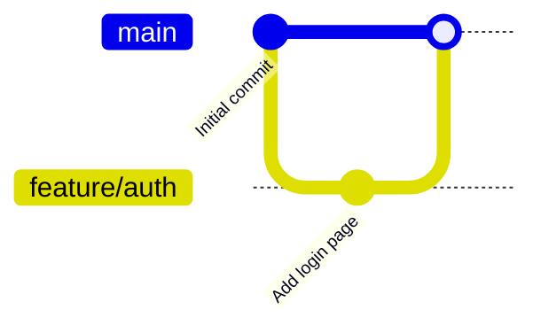
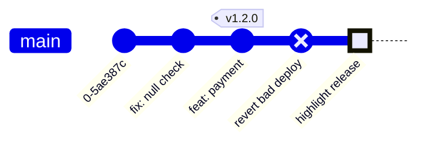
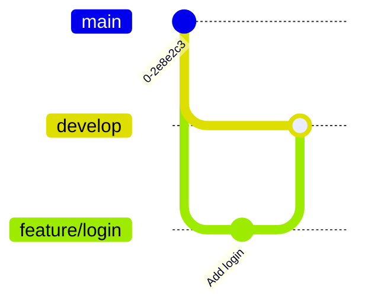
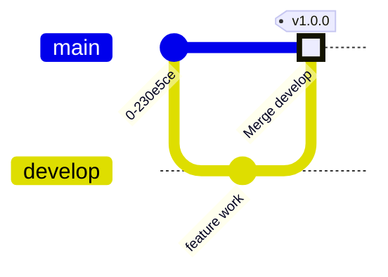
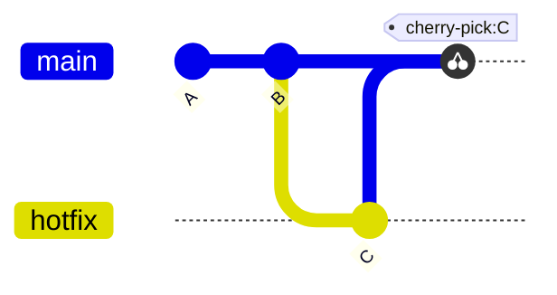
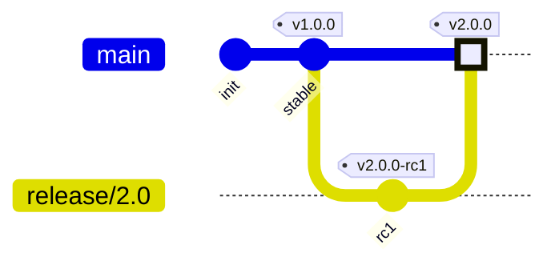
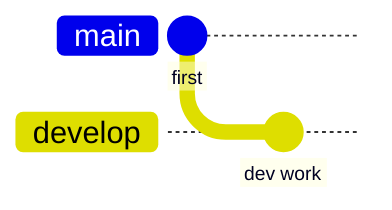
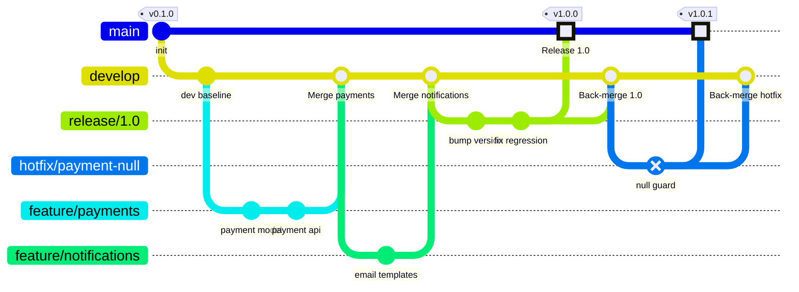
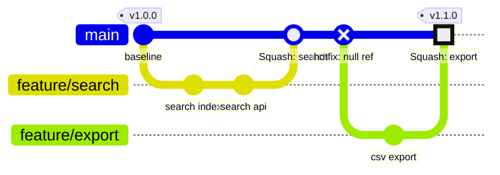

# Git Graph

## Overview

- Syntax prefix: `gitGraph`
- Visualizes branch topology, commits, merges, and tags
- Renders left-to-right by default; time flows left to right
- Default branch is `main` (configurable via `init` directive)

## Commits

| Attribute | Syntax | Effect |
|-----------|--------|--------|
| Basic commit | `commit` | Auto-generated ID, no label |
| Custom ID/label | `commit id: "message"` | Sets display label |
| Tag | `commit id: "msg" tag: "v1.0"` | Adds tag badge above commit |
| Type | `commit id: "msg" type: HIGHLIGHT` | Changes commit circle styling |

### Commit Types

| Type | Visual | Use |
|------|--------|-----|
| `NORMAL` | Filled circle | Default commit (implicit when `type` omitted) |
| `REVERSE` | Circle with X | Reverts, rollbacks |
| `HIGHLIGHT` | Filled rectangle | Release commits, milestones |

- Multiple attributes combine: `commit id: "release" tag: "v2.0" type: HIGHLIGHT`

## Branches

- `branch name` -- creates and checks out a new branch from the current HEAD
- `branch name order: N` -- controls vertical position in the diagram; lower number = higher on the diagram
- Branch ordering is visual only; it does not affect merge logic

## Checkout

- `checkout branchName` -- switches the active branch; subsequent `commit` statements apply to this branch
- Must `checkout` an existing branch or `main` -- referencing an undeclared branch causes a parse error

## Merge

| Merge attribute | Syntax | Effect |
|----------------|--------|--------|
| Basic merge | `merge branchName` | Auto-generated merge commit |
| Custom label | `merge branchName id: "msg"` | Sets merge commit display label |
| Tag on merge | `merge branchName tag: "v2.0"` | Adds tag badge to merge commit |
| Type | `merge branchName type: REVERSE` | Applies commit type styling to merge commit |

- After `merge`, the current branch remains the one that received the merge (the target, not the source)

## Cherry-Pick

- `cherry-pick id: "commitId"` -- re-applies a specific commit onto the current branch
- The `id` value must match the `id` of an existing commit in the diagram exactly
- **When cherry-picking a merge commit**, specify the parent to resolve ambiguity:
  `cherry-pick id: "mergeCommitId" parent: "parentCommitId"`

## Tags

Tags are attached inline on `commit` or `merge` statements:

- Tags render as badge labels above the commit dot
- Multiple tags on one commit are not supported -- only one `tag:` per statement

## Configuration

| Config Key | Default | Effect |
|-----------|---------|--------|
| `mainBranchName` | `"main"` | Name of the primary branch |
| `mainBranchOrder` | `0` | Vertical position of main branch |
| `showCommitLabel` | `true` | Show commit ID / label text on commits |
| `rotateCommitLabel` | `true` | Rotate long commit labels 45 degrees |
| `parallelCommits` | `false` | Align commits across branches by time rather than sequence |

- `rotateCommitLabel: false` improves readability for short labels; leave `true` for long SHA-style labels

## Workflow Pattern: GitFlow

**GitFlow branch roles:**

| Branch | Purpose | Merges into |
|--------|---------|------------|
| `main` | Stable released code | -- |
| `develop` | Integration branch | `main` (via release) |
| `feature/*` | Individual features | `develop` |
| `release/*` | Release stabilization | `main` + `develop` |
| `hotfix/*` | Production bug fixes | `main` + `develop` |

## Workflow Pattern: Trunk-Based Development

**Trunk-based rules:**
- **`main` is always deployable** -- no long-lived integration branches
- Feature branches are **short-lived** (hours to days, not weeks)
- Merge frequently; use feature flags for incomplete work
- **Squash merges** keep `main` history linear and readable

## Common Mistakes

- **Checking out an undeclared branch** -- `checkout foo` before `branch foo` causes a parse error; always declare with `branch` first
- **Cherry-picking with a non-existent id** -- the `id` in `cherry-pick id: "X"` must exactly match a `commit id: "X"` elsewhere in the diagram
- **Using `merge` without being on the target branch** -- you must `checkout targetBranch` before `merge sourceBranch`
- **Expecting horizontal time alignment by default** -- `parallelCommits: false` (default) sequences commits by statement order, not wall-clock time; enable `parallelCommits: true` to align across branches
- **Multiple tags on one commit** -- only one `tag:` attribute per `commit` or `merge` statement is supported
- **Spaces in branch names** -- use `/` or `-` as separators: `feature/login`, not `feature login`
