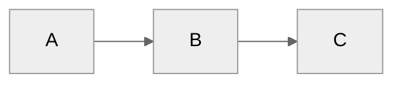
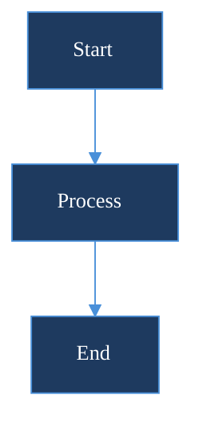
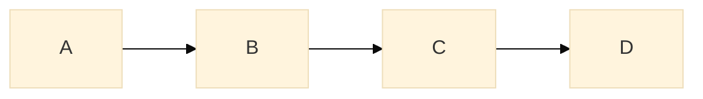
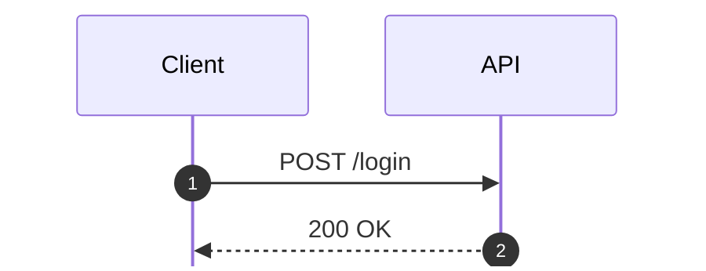
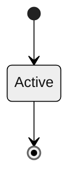
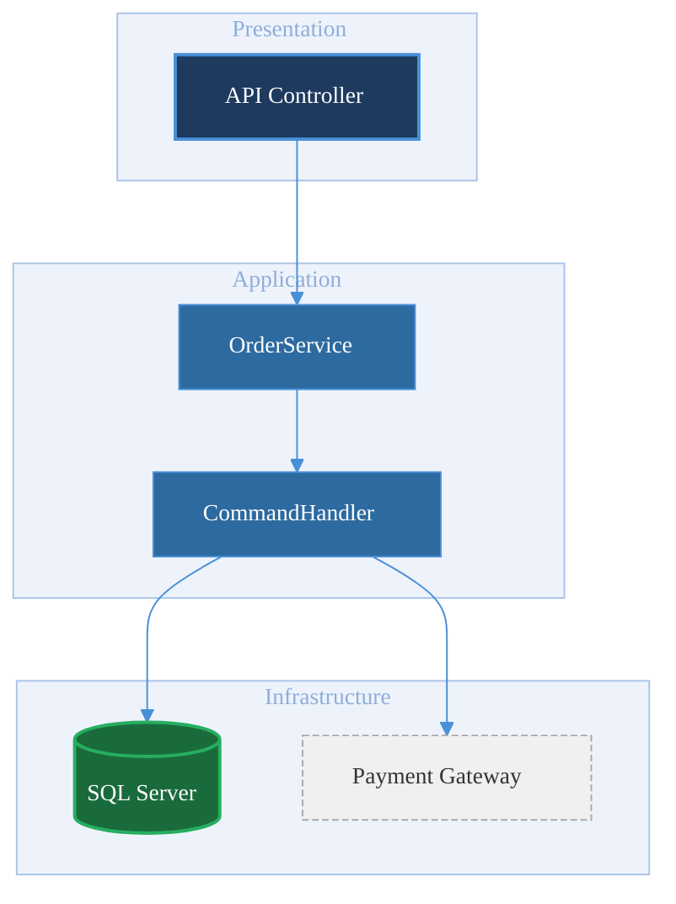

# Styling & Theming

## Built-in Themes

| Theme | Description |
|-------|-------------|
| `default` | Light background, blue nodes, gray edges -- general purpose |
| `dark` | Dark background, muted colors -- suitable for dark-mode UIs and slides |
| `forest` | Green palette, earthy tones -- nature or environmental diagrams |
| `neutral` | Monochrome grays -- professional, print-friendly |
| `base` | Minimal base with no pre-set colors -- required when using `themeVariables` for full control |

## Theme Selection

Set once per diagram on the first line:



- **`theme` key is case-sensitive** -- `"Neutral"` will not match; use lowercase
- Init directive must be the **first line** of the diagram

## themeVariables

Override individual color tokens. Requires `"theme": "base"` for full effect:



### Key themeVariables Reference

| Variable | Applies To | Example Value |
|----------|-----------|---------------|
| `primaryColor` | Default node fill | `#1e3a5f` |
| `primaryTextColor` | Default node label text | `#ffffff` |
| `primaryBorderColor` | Default node border | `#4a90d9` |
| `secondaryColor` | Secondary nodes (subgraph fills, etc.) | `#2d6a9f` |
| `tertiaryColor` | Third-tier elements | `#e8f0fe` |
| `lineColor` | Edge/arrow color | `#4a90d9` |
| `textColor` | General text (non-node labels) | `#333333` |
| `mainBkg` | Diagram canvas background | `#ffffff` |
| `nodeBorder` | Node border (alias for `primaryBorderColor` in some diagrams) | `#4a90d9` |
| `clusterBkg` | Subgraph fill | `#f0f4ff` |
| `clusterBorder` | Subgraph border | `#aac4e8` |
| `titleColor` | Diagram title text | `#1e3a5f` |
| `edgeLabelBackground` | Background behind edge label text | `#f9fbff` |
| `fontFamily` | Global font stack | `"Segoe UI, sans-serif"` |
| `fontSize` | Global font size | `"14px"` |

- **Not all variables affect every diagram type** -- flowchart, sequence, and ER each consume a subset
- Use `"theme": "base"` to prevent built-in theme colors from overriding your values

## classDef -- Per-Node Styling

Define a named style class and apply it to nodes:

```mermaid
flowchart TD
    classDef primary fill:#1e3a5f,stroke:#4a90d9,stroke-width:2px,color:#fff
    classDef success fill:#1a6b3c,stroke:#27ae60,stroke-width:1px,color:#fff
    classDef warning fill:#7d4e00,stroke:#f39c12,stroke-width:1px,color:#fff
    classDef muted   fill:#f0f0f0,stroke:#cccccc,stroke-width:1px,color:#555

    A[Request]:::primary --> B{Valid?}
    B -->|Yes| C[Process]:::success
    B -->|No|  D[Reject]:::warning
    C --> E[Done]:::muted
```

### classDef Property Reference

| Property | Description | Example |
|----------|-------------|---------|
| `fill` | Node background color | `fill:#1e3a5f` |
| `stroke` | Node border color | `stroke:#4a90d9` |
| `stroke-width` | Border thickness | `stroke-width:2px` |
| `color` | Label text color | `color:#ffffff` |
| `stroke-dasharray` | Dashed border pattern | `stroke-dasharray:5 5` |
| `font-weight` | Text weight | `font-weight:bold` |
| `font-size` | Per-class text size | `font-size:12px` |
| `rx` | Border radius (SVG) | `rx:5` |

### Applying Classes -- Two Syntaxes

```
%% Bulk assignment (multiple nodes, one class)
class nodeA,nodeB,nodeC className

%% Inline shorthand (single node at definition)
A[Label]:::className
```

- **`:::` shorthand only works at node definition** -- cannot apply inline to nodes defined elsewhere
- **`class` statement works anywhere** in the diagram body

## Per-Diagram Init Config

Each diagram type accepts its own config namespace alongside `theme`:

### Flowchart



| Key | Values | Effect |
|-----|--------|--------|
| `curve` | `basis`, `linear`, `step`, `stepBefore`, `stepAfter`, `cardinal`, `monotoneX` | Edge curve style |
| `padding` | integer (px) | Internal padding around the diagram |
| `nodeSpacing` | integer (px) | Horizontal space between nodes (same rank) |
| `rankSpacing` | integer (px) | Vertical space between ranks |
| `useMaxWidth` | `true` / `false` | Constrain diagram to container width |

### Sequence



| Key | Values | Effect |
|-----|--------|--------|
| `actorMargin` | integer (px) | Space between actor boxes |
| `messageMargin` | integer (px) | Vertical space between messages |
| `boxMargin` | integer (px) | Padding inside actor/participant boxes |
| `showSequenceNumbers` | `true` / `false` | Auto-prefix messages with sequence numbers |
| `mirrorActors` | `true` / `false` | Repeat actor row at the bottom |
| `useMaxWidth` | `true` / `false` | Constrain to container width |

### State / Other Types



- Other config keys follow the same pattern: `"er"`, `"gantt"`, `"pie"`, `"gitGraph"` namespaces

## .NET Color Palette Suggestions

Use these palettes with `themeVariables` or `classDef`:

### Professional (Navy / Slate / White)

| Role | Hex | Usage |
|------|-----|-------|
| Primary fill | `#1e3a5f` | Main nodes, headers |
| Primary border | `#4a90d9` | Node borders, arrows |
| Primary text | `#ffffff` | Text on dark nodes |
| Secondary fill | `#2d6a9f` | Secondary nodes |
| Background | `#f8fafc` | Canvas / subgraph fills |
| Muted text | `#64748b` | Labels, annotations |

### Modern (Indigo / Teal / Gray)

| Role | Hex | Usage |
|------|-----|-------|
| Primary fill | `#4f46e5` | Main nodes |
| Primary border | `#6366f1` | Node borders |
| Primary text | `#ffffff` | Text on colored nodes |
| Accent fill | `#0d9488` | Highlight / success nodes |
| Background | `#f1f5f9` | Canvas |
| Muted fill | `#e2e8f0` | Inactive / infrastructure nodes |

### Warm (Amber / Rose / Stone)

| Role | Hex | Usage |
|------|-----|-------|
| Primary fill | `#92400e` | Main nodes |
| Primary border | `#f59e0b` | Node borders, arrows |
| Primary text | `#ffffff` | Text on dark nodes |
| Accent fill | `#be123c` | Error / warning nodes |
| Background | `#faf7f4` | Canvas |
| Muted fill | `#e7e5e4` | Neutral / infra nodes |

## Combined Theme + classDef Example

Full pattern combining `themeVariables` for global defaults and `classDef` for per-role overrides:



- **`stroke-dasharray:4 2`** -- useful visual convention for external/third-party dependencies
- **Subgraphs** inherit `clusterBkg` / `clusterBorder` from `themeVariables`; override per-subgraph with `style subgraphId fill:#hex`
