# .NET Architecture Patterns

Ready-to-adapt Mermaid templates for common .NET architectural patterns. Copy the code block, adjust node labels and connections to match your domain.

---

## 1. Clean Architecture

**When to use:** Visualizing layer boundaries and dependency inversion. Dependency arrows point inward; outer layers depend on inner, never the reverse.

---

## 2. Dependency Injection Container

**When to use:** Explaining service registration and lifetime to team members; onboarding documentation for DI setup in `Program.cs`.

---

## 3. ASP.NET Core Middleware Pipeline

**When to use:** Explaining request/response pipeline order, middleware insertion points, and short-circuit behavior.

---

## 4. CQRS with MediatR

**When to use:** Documenting command/query separation, MediatR dispatch flow, and read/write database split.

---

## 5. Blazor Component Tree

**When to use:** Documenting Blazor render hierarchy, layout nesting, and render mode annotations.

---

## 6. EF Core Model Relationships

**When to use:** Documenting database schema and entity relationships for a typical blog/content domain.

---

## 7. Microservice Topology

**When to use:** C4 Container-level view of a microservice system -- API gateway, downstream services, databases, and async messaging.

---

## 8. Azure Deployment Architecture

**When to use:** Infrastructure and deployment documentation showing Azure PaaS components, connections, and data flows.

```mermaid
%%{init: {"theme": "base", "themeVariables": {"primaryColor": "#0078d4", "primaryTextColor": "#ffffff", "primaryBorderColor": "#005a9e", "lineColor": "#0078d4", "clusterBkg": "#e8f4fd", "clusterBorder": "#90c8f0", "fontFamily": "Segoe UI, sans-serif"}}}%%
flowchart TD
    classDef azure    fill:#0078d4,stroke:#005a9e,stroke-width:2px,color:#fff
    classDef data     fill:#217346,stroke:#185c37,stroke-width:2px,color:#fff
    classDef cache    fill:#dc3545,stroke:#a71d2a,stroke-width:2px,color:#fff
    classDef storage  fill:#6f42c1,stroke:#4e2d87,stroke-width:2px,color:#fff
    classDef monitor  fill:#fd7e14,stroke:#d96a0a,stroke-width:2px,color:#fff
    classDef cdn      fill:#20c997,stroke:#198754,stroke-width:2px,color:#fff
    classDef user     fill:#495057,stroke:#343a40,stroke-width:1px,color:#fff

    users["End Users\n(Browser / Mobile)"]:::user

    subgraph EdgeLayer ["Edge"]
        cdn["Azure CDN / Front Door\nGlobal Load Balancing\nWAF Rules"]:::cdn
    end

    subgraph ComputeLayer ["Compute (australiaeast)"]
        appservice["App Service Plan (P2v3)\nASP.NET Core + Blazor\nAuto-scale: 1–5 instances"]:::azure
        appservice2["Staging Slot\n(deployment swap target)"]:::azure
    end

    subgraph DataLayer ["Data"]
        sqlserver[("Azure SQL\nGeneral Purpose, 4 vCores\nGeo-redundant backup")]:::data
        redis[("Azure Cache for Redis\nC2 Standard\nSession + Output Cache")]:::cache
        blob["Azure Blob Storage\nLRS -- user uploads\nlife cycle policy: 90d"]:::storage
    end

    subgraph ObservabilityLayer ["Observability"]
        appinsights["Application Insights\nLive Metrics\nDistributed Tracing"]:::monitor
        loganalytics["Log Analytics Workspace\nRetention: 90 days"]:::monitor
    end

    keyvault["Azure Key Vault\nSecrets + Certs\nManaged Identity access"]:::azure

    users --> cdn --> appservice
    appservice --> sqlserver
    appservice --> redis
    appservice --> blob
    appservice --> appinsights
    appinsights --> loganalytics
    appservice -.->|"Managed Identity"| keyvault
    appservice -.->|"slot swap"| appservice2
```

